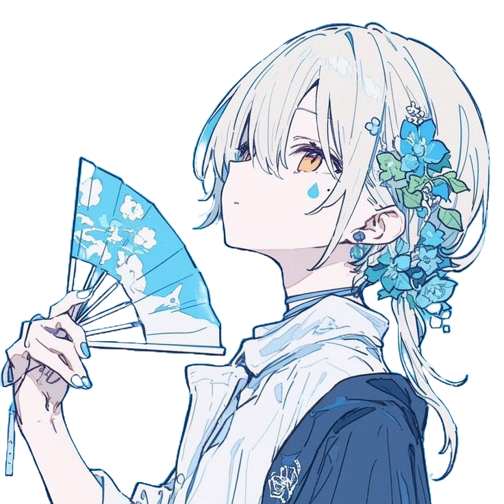

  

  
  
  
  

## About QRTX

**QRTX** is a premium Magisk / KernelSU module with a pure AMOLED WebUI. It gives you clean performance mode control (Lite / Performance / Auto / Battery), custom accent colors, multi-language support and a modern glass-style interface — while staying lightweight and battery-friendly for daily use.

Join the community: [t.me/uwEspresso](https://t.me/uwEspresso)

## Supported Root Managers

- [APatch](https://github.com/bmax121/APatch)
- [KernelSU](https://github.com/tiann/KernelSU)
- [KernelSU Next](https://github.com/KernelSU-Next/KernelSU-Next)
- [Magisk](https://github.com/topjohnwu/Magisk) / Magisk Delta
- [SukiSU](https://github.com/SukiSU-Ultra/SukiSU-Ultra)

### Also Supported on

- [KsuWebUI](https://github.com/5ec1cff/KsuWebUIStandalone)
- [WebUI-X](https://github.com/MMRLApp/WebUI-X-Portable)
- [MMRL](https://github.com/MMRLApp/MMRL)

## Features

- **Performance Modes**
  - Lite → Power efficient for light tasks
  - Performance → Maximum speed for heavy games
  - Auto → Smart balancing between performance & battery
  - Battery → Deep power saving

- Pure AMOLED WebUI designed for modern devices
- Custom accent theme colors (Purple, Lavender, Orange, Yellow, Red, Coral, Deep Blue, Sky Blue, Pink, Magenta, Sakura...)
- Multi-language support (English, Chinese, Russian, Japanese, Portuguese)
- Animated sticker support in WebUI
- Auto open Telegram channel on first install
- Lightweight & clean design focused on gaming experience

## Resources

- [Download](https://github.com/dreammwas/QRTX/releases) - Get the latest version
- [Telegram Channel](https://t.me/uwEspresso) - Stay updated with announcements
- [Report Issues](https://github.com/dreammwas/QRTX/issues) - Found a bug? Let us know!

## Community & Support

- [Telegram Channel](https://t.me/uwEspresso) - Stay updated with announcements
- [Report Issues](https://github.com/dreammwas/QRTX/issues) - Found a bug? Let us know!
- [Contribute](https://github.com/dreammwas/QRTX/pulls) - Submit improvements via PR

## License

QRTX is open-sourced software licensed under the [Apache-2.0 license](https://www.apache.org/licenses/LICENSE-2.0).
